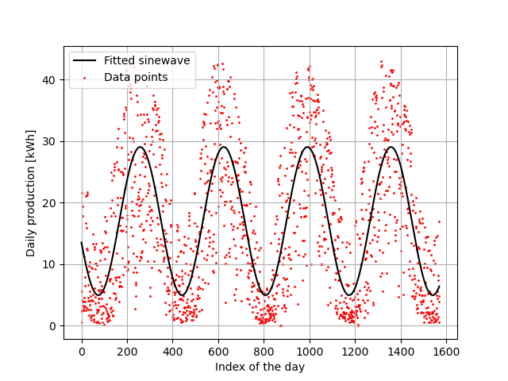

# SolarYear
Approximating the number of days in a year in a unnecessarily complicated way using solar panels.

## Introduction
This is a toy project to experiment with curve fitting in Python. I used data from a domestic photovoltaic installation
and tried to extract the periodic pattern that can be observed in this data. This pattern is due to the natural
change in light intensity that occurs throughout a year.

## Dataset
The dataset is a CSV file called 'daily_production.csv'. It contains 1584 entries and is made of two columns:
1. The first column is the date (YYYY-MM-DD) of the measurement;
2. The second one is the production of the installation on that day, in watt-hours (Wh).

## Result
Here is the figure that the program generates. It shows the original data as well as the fitted sinewave.

## Comments
The production data is very noisy because of the varying weather. Also, a sinewave is something that seems notoriously
difficult to fit when compared to other curves. For those reasons, the optimizer needs an initial guess. When using 300
days as an initial guess, the fitted value ends up being 366 days, which is pretty accurate!